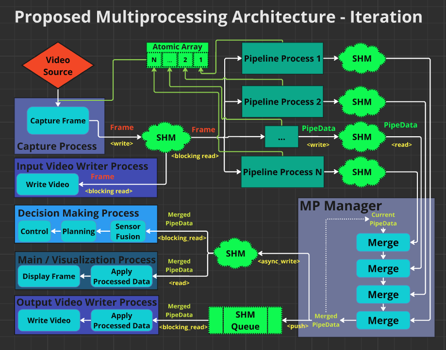
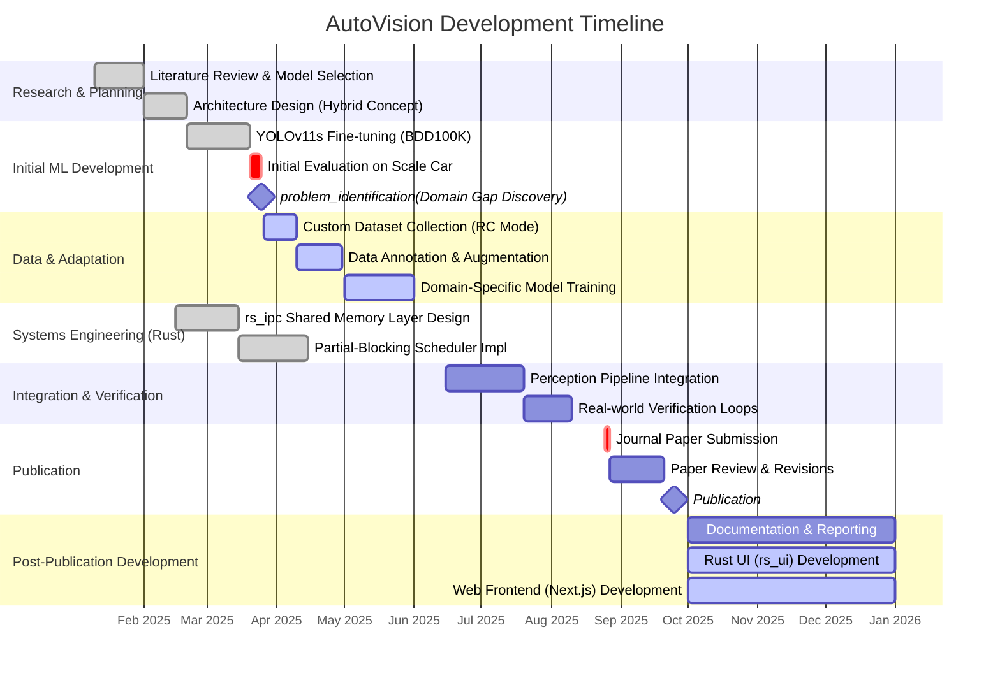

# AutoVision

**Babeș-Bolyai University, Cluj-Napoca**

[Paper](https://doi.org/10.33436/v35i3y202508) ·
[Journal page](https://rria.ici.ro/en/vol-35-no-3-2025/accelerating-intelligent-vehicle-vision-a-hybrid-python-rust-architecture-with-partial-blocking-inter-process-communication/) ·
[BibTeX](#citation)

AutoVision is a real-time autonomous driving perception stack and the reference implementation for our paper *"Accelerating intelligent vehicle vision: A hybrid Python–Rust architecture with partial-blocking inter-process communication"* (RRIA 35(3), 2025). It leverages a **Hybrid Python–Rust Architecture** to solve the "Python Latency Bottleneck" by offloading inter-process communication (IPC) and synchronization to a high-performance **Rust** shared-memory layer.

This architecture allows researchers to develop deep learning models in **Python** (using PyTorch & YOLO) while ensuring deterministic, low-latency data flow suitable for real-time control.

<p align="center">
  
</p>

### Demo

https://github.com/davszi/AutoVision/raw/main/assets/AutoVisionDemo.mp4

*(If the player does not load inline, [download the demo video](assets/AutoVisionDemo.mp4).)*

## Key Features

*   **Hybrid Architecture:** Python for ML, Rust for Systems.
*   **Shared-Memory IPC:** `rs_ipc` crate handles zero-copy data transfer.
*   **Partial-Blocking Scheduling:** Ensures the latest frame is always processed without stalling fast detection branches.
*   **Fine-Tuned Perception:** 
    *   **YOLOv11s** optimized for Traffic Signs, Lights, and Pedestrians.
    *   **Geometric Lane Detection** for robust path finding.
*   **Domain-Specific Dataset:** Trained on custom data from the actual reduced-scale vehicle environment.

## Prerequisites

*   **Python:** 3.12+
*   **Rust:** Latest stable toolchain (install via [rustup.rs](https://rustup.rs/))
*   **Conda:** (Recommended for environment management)

## Installation

### 1. Clone the Repository
```bash
git clone <repository_url>
cd AutoVision
```

### 2. Set up Python Environment
We recommend using Conda to manage dependencies.
```bash
# Create environment (using python 3.12)
conda create -n vision python=3.12
conda activate vision

# Install core python dependencies
pip install ultralytics opencv-python numpy torch torchvision
pip install maturin  # Required for building the Rust-Python bridge
```

### 3. Build & Install `rs_ipc` (Rust-Python Bridge) inside the conda environment
This project uses `maturin` to build the Rust IPC layer as a Python package.
```bash
# Navigate to the Rust IPC package
cd rs_ipc

# Build and install into the current python environment
maturin develop --release
# OR
maturin build --release
pip install target/wheels/rs_ipc-*.whl

cd ..
```

### 4. Build `rs_ui` (Visualization)
The visualization UI is written in Rust for performance.
```bash
cd rs_ui
cargo build --release
cd ..
```

## Usage

### Running the Perception Stack
To start the perception pipeline (camera capture + ML inference):
```bash
python main.py
```

### Running the Visualization
To view the output (ensure the perception stack is running or writing to shared memory):
```bash
./rs_ui/target/release/rs_ui
```

## Project Structure

*   `main.py`: Entry point for the Python perception manager.
*   `rs_ipc/`: Rust crate implementing the Shared Memory IPC and Python bindings.
*   `rs_ui/`: Rust-based visualization tool.
*   `perception/`: Python modules for YOLO models and lane detection logic.
*   `assets/`: Architecture diagram, demo video, and slide-deck presentation PDF.
*   `files/`: Configuration and resource files.

## Troubleshooting

*   **Windows Users:** Ensure you have "Desktop development with C++" installed via Visual Studio Installer, as it's required for compiling Rust code.
*   **Shared Memory Permissions:** On Linux/Docker, you may need to adjust `shm` limits or permissions. 

## Authors

*   **Dávid Szilágyi** (davtszi@gmail.com) — Lead ML engineer & Python specialist. YOLOv11s perception pipeline, fine-tuning and domain adaptation, geometric lane detection, Python-side integration with the shared-memory architecture.
*   **Răzvan Filea** (razvan.filea@stud.ubbcluj.ro) — Systems architect & Rust engineer. `rs_ipc` shared-memory layer, partial-blocking scheduling algorithm, native Rust visualization UI (`rs_ui`, Iced).
*   **Kuderna-Iulian Bența** — Academic supervisor (Babeș-Bolyai University, Cluj-Napoca).

## Development Timeline



## Citation

If you use AutoVision in academic work, please cite:

> Szilágyi, D., Filea, R., & Bența, K. (2025). Accelerating intelligent vehicle vision: A hybrid Python–Rust architecture with partial-blocking inter-process communication. *Romanian Journal of Information Technology and Automatic Control*, **35**(3), 101–116. https://doi.org/10.33436/v35i3y202508

```bibtex
@article{szilagyi2025autovision,
  title   = {Accelerating intelligent vehicle vision: A hybrid Python--Rust architecture with partial-blocking inter-process communication},
  author  = {Szil{\'a}gyi, D{\'a}vid and Filea, R{\u a}zvan and Ben{\c t}a, Kuderna-Iulian},
  journal = {Romanian Journal of Information Technology and Automatic Control},
  volume  = {35},
  number  = {3},
  pages   = {101--116},
  year    = {2025},
  doi     = {10.33436/v35i3y202508},
  url     = {https://doi.org/10.33436/v35i3y202508}
}
```

A slide-deck presentation summarising the project is bundled in this repository: [`assets/AutoVision-slides.pdf`](assets/AutoVision-slides.pdf).

Keywords: Intelligent Vehicles · Real-Time Vision · Shared Memory IPC · Python–Rust Integration · Partial-Blocking Communication.